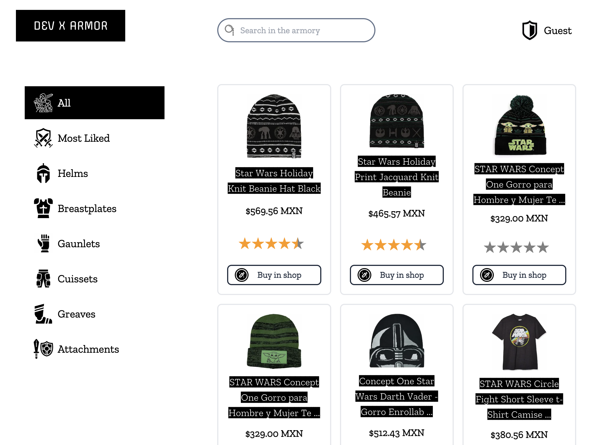

# devarmor

The online armory shop where you will find all the needed items for starting the all the adventures and sidequests that all software developer faces day to day.



## Features

- Search by category
- Search by description
- Redirect to shop in a new tab

## Technologies

[](https://reactjs.org/)
[](https://www.typescriptlang.org//)
[](https://nextjs.org)
[](https://tailwindcss.com/)

## Live Sample

[](http://devarmor.store)

## Local setup

First, clone repo, install dependencies and run the development server:

```bash
git clone git@github.com:sguerra/devarmor.git
cd devarmor
npm install
npm run dev
```

Open [http://localhost:3000](http://localhost:3000) with your browser to see the result.

## Future work

- Responsive design for mobile
- Get items from Server API
- Support of more countries (currency)
- Support stores other than Amazon
